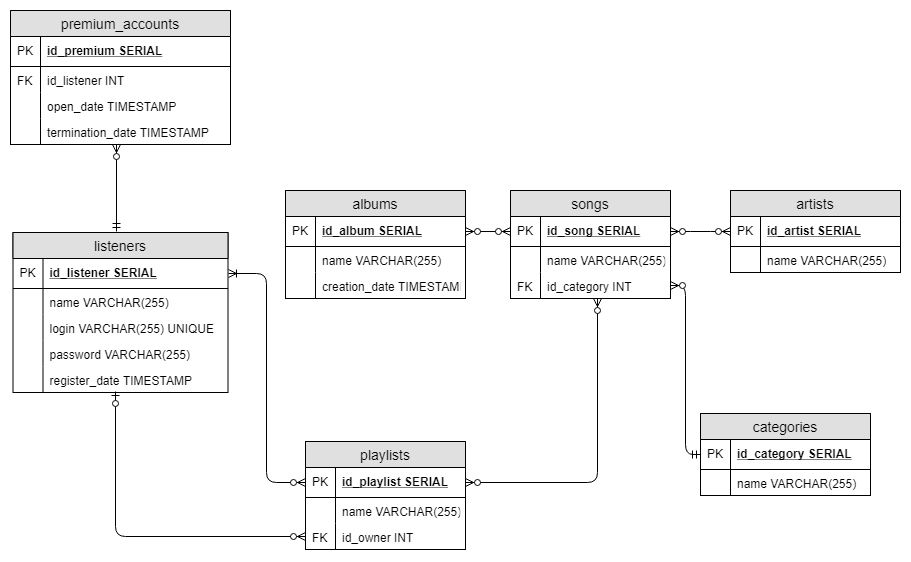

# Spotify

Create database for Spotify (listeners, artists, albums, songs, playlists, listens, subscriptions, etc.). Create an ERD diagram, then implement the database and fill it with a sample data using mockaroo or write your own data generator. Implement views, indexes, triggers, functions in your database.

Requirements:
  - Database should consist of at least 10 tables.
  - You should implement at lease one of each of those: view, index, trigger, function.
  - Your database should hold at least 100k rows in total (you can use Python/Java/... to generate more data).

  
